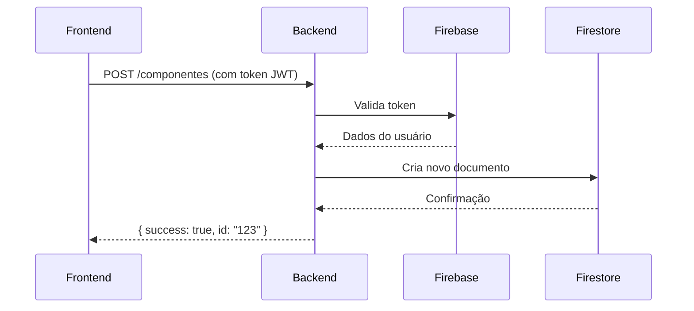

# Inatel Box

## 📌 Descrição
Este projeto é um aplicativo de inventário desenvolvido para facilitar o controle de estoque e gerenciamento componentes do Inatel. Utiliza Firebase para armazenamento e autenticação, com um front-end desenvolvido em React. O objetivo principal é proporcionar uma solução intuitiva e eficiente para o almoxarifado do Inatel com intuito dos alunos saberem as ferramentas que tem no almoxerifado de maneira intuitiva e organizada.

## 🔧 Funcionalidades Principais
- 📦 **Cadastro e gerenciamento de produtos**: Permite adicionar novos produtos ao inventário, com nome, ID, tipo, categoria e quantidade em estoque.
- 📊 **Controle de estoque**: Atualiza automaticamente o estoque ao adicionar, remover um produto.
- 🔑 **Autenticação e gerenciamento de usuários**: Usuários podem se cadastrar, fazer login e acessar funcionalidades restritas.
- 🔍 **Pesquisa e filtros**: Facilita a busca de produtos por nome, categoria ou ID.
- 📢 **Notificações e alertas**: Notifica ao aluno para devolver um componente, garantindo que o aluno não faça matricula por causa de esquecimento.

## 📅 Organização de Tarefas
A equipe adota uma metodologia ágil para organização das tarefas, utilizando sprints para dividir o desenvolvimento em etapas menores e mais gerenciáveis. As sprints foram definidas da seguinte forma:

- **Demo 1:** 11/03 - 31/03  
- **Demo 2:** 01/04 - 21/04  
- **Demo 3:** 22/04 - 19/05  
- **Demo 4:** 20/05 - 16/06  
- **Entrega final:** 17/06  

As tarefas são distribuídas entre os membros da equipe e gerenciadas por meio de um sistema de versionamento e controle de progresso.

## 👥 Equipe
- **Silas Rodrigues** 
- **Felipe Silveira** 
- **Antonio** 
- **Felipe**

## 🛠 Tecnologias Utilizadas
<div/>

🖥️ **Frontend**  


📦 **Backend**  


🧪 **Testes**  


</div>

## 🔗 Diagrama de Fluxo (Comunicação entre o Frontend e Backend)

## Como Executar
Pré-requisitos
- Node.js 18.1

- Firebase Project 

- Conta de serviço Firebase

  ### 1-Clone o repositório
  ```bash
  git clone https://github.com/seu-usuario/almoxarifado-eletronico.git
  cd almoxarifado-eletronico
  ```

  ### 2-Backend

  ```bash
  cd backend
  npm start
  ```

  ### 3-Frontend
  
  ```bash
  cd frontend
  npm start
  ```
## Comandos Para Testes
  ### Cypress (frontend + e2e):
  
  ```bash
       cd tests
       npx cypress run
  ```
     
  ### Jest (CRUD + integração):
  ```bash
       cd tests
       jest tests/integration/component.tests.cjs 
       jest tests/integration/auth.tests.cjs
  ```
